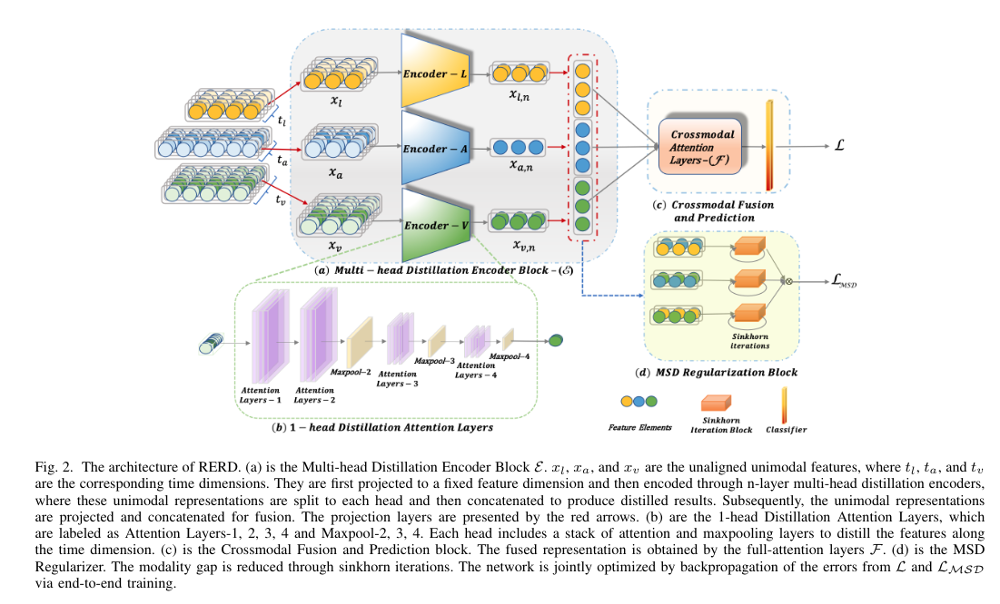

  

# RERD

> Pytorch implementation for RERD


## Paper
[**Deep Multimodal Sequence Fusion by Regularized Expressive Representation Distillation**](https://ieeexplore.ieee.org/abstract/document/9681296/)<br>
[Xiaobao Guo], [Adams Wai-Kin Kong] *, and [Alex Kot]<br>
IEEE Transactions on Multimedia, 2022.

Please cite our paper if you find our work useful for your research:

```tex
@article{guo2022deep,
  title={Deep Multimodal Sequence Fusion by Regularized Expressive Representation Distillation},
  author={Guo, Xiaobao and Kong, Wai-Kin Adams and Kot, Alex C},
  journal={IEEE Transactions on Multimedia},
  year={2022},
  publisher={IEEE}
}
```


### Overall Architecture for RERD
<p align="center">


RERD is comprised of the two major components based on an intermediate-fusion pipeline: (1) a multi-head distillation encoder is proposed to enhance unimodal representations from unaligned multimodal sequences, where the distillation attention layers dynamically capture and extract the most expressive unimodal features and (2) a novel multimodal sinkhorn distance regularizer is introduced to aid the joint optimization in training. 


  
### Prerequisites
- Python 3.7 or above
- [Pytorch (>=1.0.0) and torchvision](https://pytorch.org/)
- CUDA 10.0 or above

### Data preparation:

The processed MOSI, MOSEI can be downloaded from [here](https://www.dropbox.com/sh/hyzpgx1hp9nj37s/AAB7FhBqJOFDw2hEyvv2ZXHxa?dl=0).

The SIMS dataset can be downloaded from [here](https://github.com/thuiar/MMSA)

Bert pretrained model can be found from [here](https://github.com/thuiar/MMSA)

### Run the Code

1. Create folders for data and models:
~~~~
mkdir data all_models
mkdir data/pretrained_bert
~~~~

and put or link the data under 'data/'.

2. Training:
~~~~
python main.py [--params]
e.g.,
CUDA_VISIBLE_DEVICES=4,5 python main.py \
--model=RERD --lonly --aonly --vonly \
--name='RERD-01' \
--dataset='mosei' --data_path='./data/MOSEI' \
--batch_size=16 --use_bert=True\
--bert_path='./data/pretrained_bert/'
--dis_d_mode=64 --dis_n_heads=4 --dis_e_layers=2 \
--optim='Adam' --reg_lambda=0.1 \
--schedule='c' --lr=0.001 --nlevels=2
~~~~

### Acknowledgement
Some portion of the code were adapted from the [fairseq](https://github.com/pytorch/fairseq), [MMSA](https://github.com/thuiar/MMSA), and [Informer](https://github.com/zhouhaoyi/Informer2020) repo.


